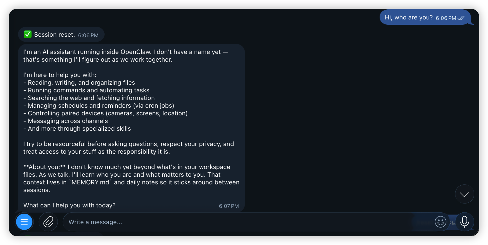
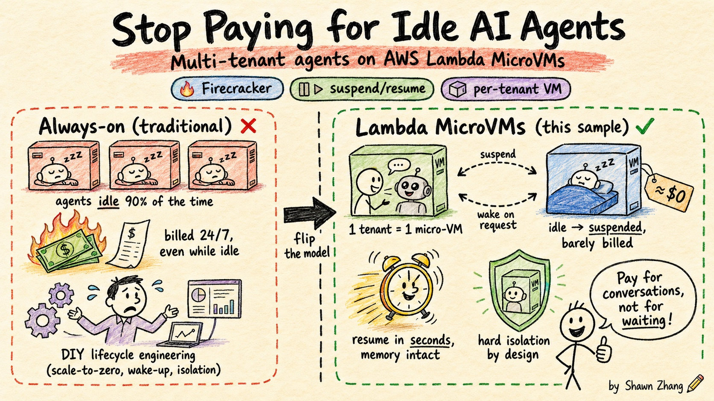

# Multi-tenant AI agents on AWS Lambda MicroVMs

> One isolated Firecracker MicroVM per tenant — cold-started, resumed, and reaped on
> demand — so a self-hosted AI agent scales to many tenants at near-zero idle cost.

[](LICENSE)
[](https://aws.amazon.com/about-aws/whats-new/2026/06/aws-lambda-microvms/)
[](docs/)

A working, end-to-end system: run a self-hosted AI agent
([OpenClaw](https://github.com/openclaw/openclaw)) **one isolated MicroVM per tenant**,
with per-tenant state persisted on EFS, model calls served by Amazon Bedrock, and a
push-based (Telegram webhook) orchestrator that cold-starts, resumes, and reaps tenant
VMs on demand. Over Telegram the agent **understands images**, **streams its replies**
(the message grows live as the model generates), and **switches Bedrock models** with
`/model` — the model catalog is discovered from Bedrock at cold start, so newly
released models appear without a code change.

Built on [AWS Lambda MicroVMs](https://aws.amazon.com/about-aws/whats-new/2026/06/aws-lambda-microvms/)
(GA June 2026) — Firecracker-isolated, snapshot-resumable serverless compute with an 8-hour
lifetime. Everything here was verified live on AWS; the design decisions and the (many)
gotchas hit along the way are written up in [`docs/`](docs/).

## Demo

Messaging a tenant's Telegram bot cold-starts its MicroVM and drives a live agent turn —
here the freshly-booted agent introduces itself:



## Why this project



Self-hosted agents are traditionally "always-on" — a container or VM per user, running
(and billing) 24/7 even while idle. That doesn't scale to many tenants. Lambda MicroVMs
flip the model, and this project shows how to exploit that for a multi-tenant agent:

- **Near-zero idle cost.** An idle tenant's VM auto-suspends; a fully idle tenant is
  terminated and its state parks on EFS for ≈$0. You pay for conversation, not for
  waiting — the economic foundation that makes one-VM-per-tenant affordable at scale.
- **Fast resume, not cold boot.** Resuming a suspended MicroVM restores the Firecracker
  snapshot — process memory and all — in ~seconds, so a returning user hits a warm agent
  (bundle loaded, provider pre-warmed) instead of waiting for a container to boot.
- **Automatic lifecycle management.** The platform suspends/resumes on traffic; the
  orchestrator cold-starts dead tenants on demand and a sweeper reaps idle ones. No
  cluster to run, no autoscaler to tune — tenants flow hot → warm → cold on their own.
- **Hard per-tenant isolation.** Each tenant gets its own Firecracker microVM, not a
  shared process or namespace — a strong security boundary between customers by default.
- **Zero static credentials.** The workload gets its AWS access from the MicroVM's IMDSv2
  execution role; no keys are baked into the image or env. The stock SDK/CLI just work.

Beyond the lifecycle story, the Telegram experience covers what users actually expect
from a chat agent:

- **Vision.** Send a photo (with or without a caption) and the agent looks at it —
  images flow from Telegram through the orchestrator into the VM as base64 attachments
  and on to a vision-capable Claude model on Bedrock.
- **Streaming replies.** Telegram has no native streaming, so the worker sends a
  placeholder and grows it via `editMessageText` (~1 edit/s, Telegram's ceiling) while
  the model generates — the reply reads like it's being typed, not delivered as one
  block after a long wait.
- **Live model catalog.** `/model` switches the session between Bedrock-hosted Claude
  models. The catalog (with correct text/image modalities) is discovered from Bedrock's
  API at each cold start and baked into the agent's config — new models show up on
  their own, and sessions pinned to a since-retired model self-heal on the next cold
  start instead of deadlocking.

## Architecture


Credentials reach the VM via its IMDSv2 execution role (no static keys); idle VMs
suspend and auto-resume, and are reaped within the 8-hour max lifetime — state
survives on EFS across VM generations.

## Quickstart

Four commands take you from an empty account to a talking agent. You need AWS CLI v2 with
the `lambda-microvms` subcommands and credentials for a [MicroVMs launch
region](#requirements--notes) — `deploy.sh` pre-flights both before touching anything.
Full prerequisites and the Telegram-push path are in [`src/README.md`](src/README.md).

```bash
cd src

# 1. Deploy the whole system (~10 min: CloudFormation + MicroVM image build + connector).
./deploy.sh openclaw-mt us-east-1

# 2. Register an HTTP-only tenant.
./add-tenant.sh openclaw-mt us-east-1 tenant1

# 3. Chat with it. The first turn cold-starts the tenant's MicroVM (~90s); later turns are warm.
./chat.sh openclaw-mt us-east-1 tenant1 "Remember my lucky number is 7777."
./chat.sh openclaw-mt us-east-1 tenant1 "What's my lucky number?"
# → cold: True ... then cold: False | reply: 7777   (state survived on EFS)

# 4. Tear it all down (terminates only this stack's VMs, then deletes the stack).
./teardown.sh openclaw-mt us-east-1
```

## Repository layout

| Directory | What it is | Details |
|---|---|---|
| [`src/`](src/) | **Start here.** Reproduce the whole system from zero — CloudFormation template, one-command deploy, tenant/lifecycle scripts, the MicroVM image, the orchestrator. | [`src/README.md`](src/README.md) — prerequisites, step-by-step deploy/test/teardown, gotchas |
| [`docs/`](docs/) | The "why" behind the code: the design decisions taken while building. | [`docs/README.md`](docs/README.md) — index of the design notes |

## Requirements & notes

- **Region.** Deploy in a region where Lambda MicroVMs has launched (`us-east-1` was
  used for verification) — `deploy.sh` probes the target region up front and fails fast
  with the reason if the service isn't reachable there, so the launch list is never
  hardcoded.
- **Security.** `deploy.sh` mints a random per-checkout gateway token on first run
  (kept in `src/.gateway-token`, git-ignored, reused across redeploys); the
  `poc-microvm-token-42` strings remaining in code are inert fallbacks, and the real
  boundary is IAM + per-request auth tokens either way. To report a vulnerability,
  see [CONTRIBUTING.md](CONTRIBUTING.md#security-issue-notifications).
- **Maturity.** This is a sample verified live on AWS (June 2026), not production-hardened —
  the open items for hardening are called out in [`docs/`](docs/).

## License

MIT — see [LICENSE](LICENSE). OpenClaw itself is MIT-licensed and is not vendored here.
