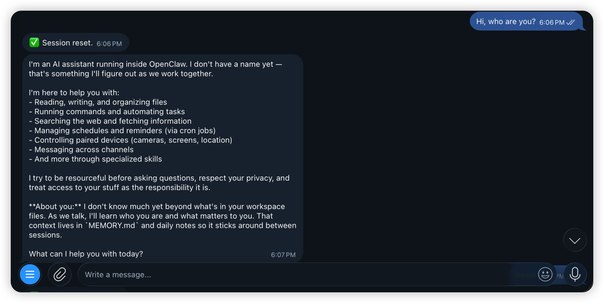
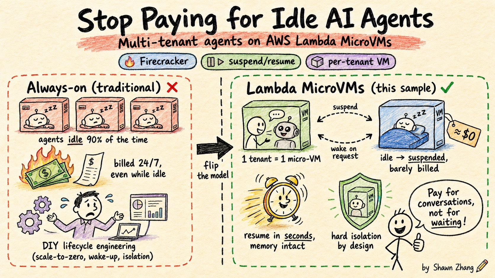

# Multi-tenant AI agents on AWS Lambda MicroVMs

> One isolated Firecracker MicroVM per tenant — cold-started, resumed, and reaped on
> demand — so a self-hosted AI agent scales to many tenants at near-zero idle cost.

[](LICENSE)
[](https://aws.amazon.com/about-aws/whats-new/2026/06/aws-lambda-microvms/)
[](docs/)

> [!IMPORTANT]
> **This is a sample project, not a production system.** Its purpose is to show the core
> multi-tenant orchestration logic — one Firecracker MicroVM per tenant, cold-started,
> resumed and reaped on demand, with per-tenant state — and everything around that is
> kept deliberately minimal. The security machinery a real multi-tenant service needs
> (end-user authentication and authorization, secrets management, per-tenant rate limits
> and spend caps, abuse and prompt-injection defenses, auditing) is **out of scope here
> and is yours to implement.** Do not expose a deployment to untrusted users as-is —
> [Not production-ready](#not-production-ready) lists the specific gaps.

A working, end-to-end system: run a self-hosted AI agent
([OpenClaw](https://github.com/openclaw/openclaw)) **one isolated MicroVM per tenant**,
with per-tenant state persisted on EFS, model calls served by Amazon Bedrock, and a
push-based (Telegram webhook) orchestrator that cold-starts, resumes, and reaps tenant
VMs on demand. Over Telegram the agent **understands images**, **streams its replies**
(the message grows live as the model generates), and **switches Bedrock models** with
`/model` — the model catalog is discovered from Bedrock at cold start, so newly
released models appear without a code change.

Built on [AWS Lambda MicroVMs](https://aws.amazon.com/about-aws/whats-new/2026/06/aws-lambda-microvms/)
(GA June 2026) — Firecracker-isolated, snapshot-resumable serverless compute with an 8-hour
lifetime. Everything here was verified live on AWS; the design decisions and the (many)
gotchas hit along the way are written up in [`docs/`](docs/).

## Demo

Messaging a tenant's Telegram bot cold-starts its MicroVM and drives a live agent turn —
here the freshly-booted agent introduces itself:



## Why this project



Self-hosted agents are traditionally "always-on" — a container or VM per user, running
(and billing) 24/7 even while idle. That doesn't scale to many tenants. Lambda MicroVMs
flip the model, and this project shows how to exploit that for a multi-tenant agent:

- **Near-zero idle cost.** An idle tenant's VM auto-suspends; a fully idle tenant is
  terminated and its state parks on EFS for ≈$0. You pay for conversation, not for
  waiting — the economic foundation that makes one-VM-per-tenant affordable at scale.
  (The stack itself keeps one always-on NAT gateway for the agent's web access,
  ~$32/month — per-stack, not per-tenant; drop it if your agents don't need the
  internet.)
- **Fast resume, not cold boot.** Resuming a suspended MicroVM restores the Firecracker
  snapshot — process memory and all — in ~seconds, so a returning user hits a warm agent
  (bundle loaded, provider pre-warmed) instead of waiting for a container to boot.
- **Automatic lifecycle management.** The platform suspends/resumes on traffic; the
  orchestrator cold-starts dead tenants on demand and a sweeper reaps idle ones. No
  cluster to run, no autoscaler to tune — tenants flow hot → warm → cold on their own.
- **Hard per-tenant isolation.** Each tenant gets its own Firecracker microVM, not a
  shared process or namespace — a strong security boundary between customers by default.
- **Zero static credentials.** The workload gets its AWS access from the MicroVM's IMDSv2
  execution role; no keys are baked into the image or env. The stock SDK/CLI just work.

Beyond the lifecycle story, the Telegram experience covers what users actually expect
from a chat agent:

- **Vision.** Send a photo (with or without a caption) and the agent looks at it —
  images flow from Telegram through the orchestrator into the VM as base64 attachments
  and on to a vision-capable Claude model on Bedrock.
- **Streaming replies.** Telegram has no native streaming, so the worker sends a
  placeholder and grows it via `editMessageText` (~1 edit/s, Telegram's ceiling) while
  the model generates — the reply reads like it's being typed, not delivered as one
  block after a long wait.
- **Long turns.** A turn that outlives the polling Lambda invocation (15 min hard max)
  is relayed to a chained self-invoke, so a single turn is bounded only by the VM's
  8h lifetime — not by any Lambda or API Gateway timeout.
- **Live model catalog.** `/model` switches the session between Bedrock-hosted Claude
  models. The catalog (with correct text/image modalities) is discovered from Bedrock's
  API at each cold start and baked into the agent's config — new models show up on
  their own, and sessions pinned to a since-retired model self-heal on the next cold
  start instead of deadlocking.
- **Web access.** The agent's built-in `web_search` / `web_fetch` tools work: the VM
  subnet routes internet-bound traffic through a NAT gateway (search uses the key-free
  DuckDuckGo provider), while Bedrock and EFS traffic still take their private
  VPC-endpoint / mount-target paths.

## Architecture


Credentials reach the VM via its IMDSv2 execution role (no static keys); idle VMs
suspend and auto-resume, and are reaped within the 8-hour max lifetime — state
survives on EFS across VM generations.

## Quickstart

Four commands take you from an empty account to a talking agent. You need AWS CLI v2 with
the `lambda-microvms` subcommands and credentials for a [MicroVMs launch
region](#requirements) — `deploy.sh` pre-flights both before touching anything.
Full prerequisites and the Telegram-push path are in [`src/README.md`](src/README.md).

```bash
cd src

# 1. Deploy the whole system (~10 min: CloudFormation + MicroVM image build + connector).
./deploy.sh openclaw-mt us-east-1

# 2. Register an HTTP-only tenant.
./add-tenant.sh openclaw-mt us-east-1 tenant1

# 3. Chat with it. The first turn cold-starts the tenant's MicroVM (~90s); later turns are warm.
./chat.sh openclaw-mt us-east-1 tenant1 "Remember my lucky number is 7777."
./chat.sh openclaw-mt us-east-1 tenant1 "What's my lucky number?"
# → cold: True ... then cold: False | reply: 7777   (state survived on EFS)

# 4. Tear it all down (terminates only this stack's VMs, then deletes the stack).
./teardown.sh openclaw-mt us-east-1
```

## Repository layout

| Directory | What it is | Details |
|---|---|---|
| [`src/`](src/) | **Start here.** Reproduce the whole system from zero — CloudFormation template, one-command deploy, tenant/lifecycle scripts, the MicroVM image, the orchestrator. | [`src/README.md`](src/README.md) — prerequisites, step-by-step deploy/test/teardown, gotchas |
| [`docs/`](docs/) | The "why" behind the code: the design decisions taken while building. | [`docs/README.md`](docs/README.md) — index of the design notes |
| [`tests/`](tests/) | Offline regression tests for the router's authentication rules — no AWS calls, no deployed stack. | `uv run --with pytest python -m pytest tests -q` |

## Not production-ready

What this sample covers is **tenant orchestration**: the registry, the two-branch router,
cold start, resume, reap, and per-tenant state. The isolation boundary it builds on is
real, but a multi-tenant *service* needs a great deal more than a boundary, and that part
is not here. Read this section before deploying anything you care about.

**What the sample does do**

- One Firecracker MicroVM per tenant. The tenant id is delivered by the platform's run
  hook, and OpenClaw's gateway stays loopback-only inside the VM — the orchestrator
  reaches it only through a MicroVM auth token that is minted per turn, expires in ≤55
  minutes, and is scoped to the single sidecar port.
- Per-tenant state confined to its own subdirectory on an encrypted EFS filesystem.
- Bedrock reached over VPC endpoints; separate IAM roles for image build, VM runtime, and
  the orchestrator.
- Exactly two public routes: `/tg/<tenantId>`, which requires that tenant's webhook secret
  in `X-Telegram-Bot-Api-Secret-Token`, and `/health`. Everything else is 404, and no route
  takes a tenantId from a URL and runs a caller-supplied prompt in that tenant's VM.
  Synchronous testing goes through `chat.sh`, which invokes the orchestrator with your AWS
  credentials rather than over the public API. Locked in by
  [`tests/test_router_auth.py`](tests/test_router_auth.py); details in
  [`src/README.md`](src/README.md#public-surface).
- `deploy.sh` mints a random per-checkout gateway token on first run (kept in
  `src/.gateway-token`, git-ignored, reused across redeploys) rather than shipping a shared
  default; the `poc-microvm-token-42` strings left in code are inert fallbacks.

**What you must add before anyone but you touches it**

- **End-user authentication and authorization.** There is no identity layer and no notion
  of a "caller". Tenants are provisioned by an operator holding AWS credentials
  (`add-tenant.sh`), and the only authenticated caller at runtime is Telegram, via a shared
  per-tenant secret. Any entry point you add for real users needs its own authenticator
  (e.g. an API Gateway JWT authorizer) **and** a check that the authenticated principal owns
  the tenant it is asking for — the tenant id must never be trusted just because it arrived
  in a URL.
- **Secrets management.** Tenant bot tokens and webhook secrets are stored as ordinary
  DynamoDB attributes. Move them to Secrets Manager or SSM Parameter Store and grant the
  orchestrator read access there instead.
- **Rate limits, quotas and spend caps.** Nothing bounds a tenant: no per-tenant request
  throttle, no ceiling on VM launches, no Bedrock token budget, and no protection in front
  of the API. Cost is the denial-of-service vector here.
- **Prompt-injection and tool-abuse defenses.** The agent has internet egress plus web
  fetch/search tools, so content it reads can try to steer it. Constrain the tool set, the
  reachable egress destinations, and what the agent is allowed to do with tenant data.
- **Auditing and log hygiene.** CloudWatch receives operational logs only — there is no
  per-tenant audit trail, and no log group declares a retention period, so logs (which do
  carry tenant ids and Telegram chat ids) are kept forever by default.
- **Availability and durability.** Single region, single AZ, one EFS mount target, no EFS
  backup policy, no DynamoDB point-in-time recovery. The registry is the only record of
  which VM and which state directory belong to which tenant.
- **Storage hardening.** EFS Access Point with a non-root POSIX identity and single-writer
  enforcement per tenant state directory — written up in
  [`docs/design/storage-options.md`](docs/design/storage-options.md).

None of the above is a defect report; it is the edge of this sample's scope, stated so you
can see where your work starts. If you do find something that breaks the isolation the sample
*does* claim — the two routes above, the per-tenant token scoping, the per-tenant state
split — please report it via
[CONTRIBUTING.md](CONTRIBUTING.md#security-issue-notifications).

## Requirements

- **Region.** Deploy in a region where Lambda MicroVMs has launched (`us-east-1` was
  used for verification) — `deploy.sh` probes the target region up front and fails fast
  with the reason if the service isn't reachable there, so the launch list is never
  hardcoded.

## License

MIT — see [LICENSE](LICENSE). OpenClaw itself is MIT-licensed and is not vendored here.
