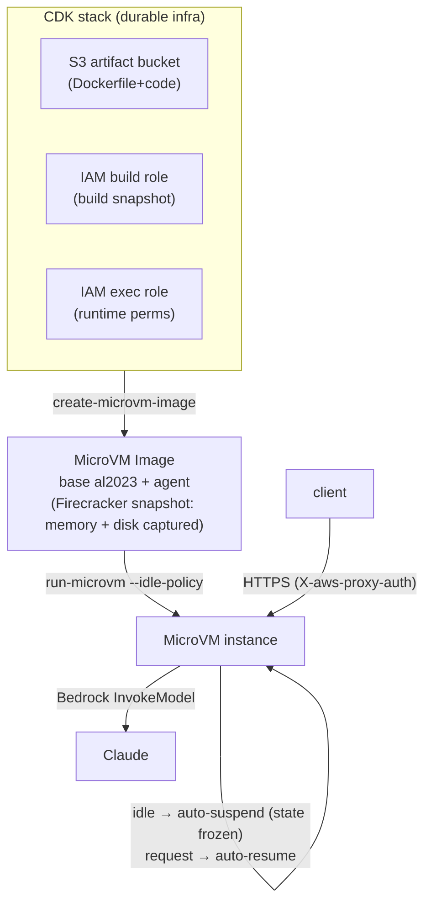

# PoC Plan — Deploy a stateful agent on AWS Lambda MicroVMs

**Account:** <ACCOUNT_ID> (`Admin`) · **Region:** us-east-1 (a MicroVMs launch region) · **IaC:** CDK
**Goal to prove:** *stateful suspend / resume* — the agent keeps memory/session across an idle auto-suspend and resumes near-instantly.
**LLM backend:** Amazon Bedrock (already enabled in this account) — see §1.1 caveat.
**Agent:** **OpenClaw** (`ghcr.io/openclaw/openclaw`) — chosen by user; specs from `../lambda-microvms-promo/references/container-image-research.md` (2026-07-04). Those specs were gathered in the same environment that fabricates data for this repo → **re-verify by actually pulling the arm64 image in Phase 0**, don't build on them blindly.

---

## 0. Ground truth already verified

- ✅ Identity `Admin` on <ACCOUNT_ID>, region us-east-1 (MicroVMs is GA here).
- ✅ Bedrock Claude models available (opus-4-8, sonnet-5, haiku-4-5, …).
- ✅ S3 + CDK bootstrapped (`cdk-hnb659fds-assets-<ACCOUNT_ID>-us-east-1`), SAM present.
- ⚠️ Installed AWS CLI 2.34.47 **has no `lambda-microvms` command set** → must upgrade CLI or drive via SDK/CDK.
- ⚠️ The `lambda-microvms` API surface below is taken from the two AWS release pages only; **Phase 1 gates on proving it is callable in this account before we build anything.**

---

## 1. The agent as a swappable box (the contract)

Any agent that satisfies this contract drops into the PoC unchanged. When you hand me the verified
agent (OpenClaw / Hermes / OpenHands / other), I fill in these blanks and nothing else moves:

| Contract slot | Requirement | Why MicroVM cares |
|---|---|---|
| **Container** | Builds for **linux/arm64** | MicroVMs are **ARM64-only** |
| **HTTP surface** | Listens on one TCP port, e.g. `:8080`, binds `0.0.0.0` | MicroVM exposes it behind a dedicated HTTPS URL (HTTP/2, gRPC, WS) |
| **Health** | `GET /health` → 200 | Launch/resume readiness probe |
| **State on disk** | Writes session/memory to a **known dir** (e.g. `/var/agent/state`) | Snapshot + suspend/resume persists memory **and** disk; state must survive suspension |
| **LLM config** | Reads endpoint/creds from env | We point it at Bedrock via env + IAM (no keys) |
| **Footprint** | ≤ 16 vCPU / 32 GB mem / 32 GB disk | MicroVM per-instance ceiling |

**Fit budget per MicroVM:** 16 vCPU · 32 GB RAM · 32 GB disk · 8 h max runtime.

### 1.1 OpenClaw-specific facts (from research doc) + the risks they create

| Fact (from research doc) | Consequence for this PoC |
|---|---|
| Image is **multi-arch, has an `arm64` tag** (`ghcr.io/openclaw/openclaw:latest`, `:slim`) | ✅ satisfies MicroVM ARM64-only requirement — **but Phase 0 must actually `docker pull --platform linux/arm64` to confirm the arm64 manifest is real, not just claimed** |
| Stack = **TypeScript / Node 24**; it's a "**Gateway / control plane**" that plugs into WhatsApp/Slack/Telegram/etc. | It is **not primarily an HTTP request/response API** — it's a long-running gateway with a Control UI on **:18789** (+ :18790 bridge, :3978 Teams). The MicroVM HTTPS URL will front **:18789**. |
| Needs **gateway token + AI-provider credentials + a mounted config volume** | State/config lives in a **mounted volume** → that mount path is exactly what must sit on the MicroVM's persisted disk for suspend/resume. **Finding OpenClaw's data/config dir is a Phase-0 task.** |
| **Supports Amazon Bedrock** (user-confirmed) via the AWS SDK | ✅ Bedrock is viable. The open question is no longer "does OpenClaw support Bedrock" but **"how does the MicroVM inject the IAM execution-role's creds so OpenClaw's SDK picks them up?"** → new prerequisite gate, see §1.2. |
| `docker-compose.yml` = `openclaw-gateway` + `openclaw-cli`, **no DB/redis sidecars** | ✅ single self-contained container — good fit for one MicroVM, no external datastore to host. |
| `slim` and `browser` variants exist | Use **`slim`** for the PoC (smaller → faster snapshot/launch). Skip `browser` unless a web-task demo is needed. |

### 1.2 THE prerequisite gate — how does a MicroVM deliver IAM creds to the workload? *(user-flagged #1)*

User confirms OpenClaw can use Bedrock. So the make-or-break unknown for the whole PoC is:
**does a running Lambda MicroVM expose its execution role the way Lambda functions / ECS tasks / EC2 do — so an unmodified AWS SDK inside the container transparently picks up temporary creds and calls `bedrock:InvokeModel`?**

Why this is non-obvious (it's a genuinely new primitive):
- **Lambda functions** inject creds via env vars (`AWS_ACCESS_KEY_ID`/`_SECRET`/`_SESSION_TOKEN`) + the Runtime API.
- **ECS/Fargate** use a container-credentials endpoint (`AWS_CONTAINER_CREDENTIALS_RELATIVE_URI` → 169.254.170.2).
- **EC2/EKS** use IMDS (169.254.169.254) / EKS Pod Identity.
- A MicroVM is a **snapshot-restored micro-VM** — which (if any) of these mechanisms it presents, and whether creds survive/rotate correctly across **suspend → resume**, is exactly what must be proven. Snapshotting adds a real risk: **short-lived creds captured in a snapshot could be expired on resume** → the SDK must be able to refresh them from whatever endpoint the MicroVM provides.

**Decision:** this is validated by a dedicated **mini-PoC** (a sub-agent designs it), BEFORE any OpenClaw work. See Phase 0.5.

Fallback ladder if native IAM cred delivery turns out unavailable/awkward:
1. ✅ **Native role creds** (env vars / container-cred endpoint / IMDS) — the goal; unmodified SDK just works.
2. **Explicitly pass short-lived STS creds** into the MicroVM at `run-microvm` time (works but doesn't survive an 8 h session / suspend-resume cleanly).
3. **Anthropic API key in Secrets Manager** (last resort, drops the "IAM → Bedrock" story the user wants).

---

## 2. Architecture

- **LLM path:** agent → Bedrock `InvokeModel` (IAM on the **execution role**, no API keys, all-AWS).
- **State path:** agent writes to `/var/agent/state`; suspend freezes memory+disk; resume restores both.

---

## 3. IAM (least-privilege for a PoC)

- **Build role** (`MicroVMBuildRole`): assumed by the image builder; read the S3 artifact, write build logs to `/aws/lambda/microvms/<image>`.
- **Execution role** (`MicroVMExecutionRole`): attached to the running MicroVM; `bedrock:InvokeModel` (+`InvokeModelWithResponseStream`) scoped to the chosen Claude model ARN, plus CloudWatch Logs.

---

## 4. IaC reality check (do this in Phase 1, it changes the tooling)

The service is days old. Before committing to pure CDK, verify in-account:
1. `aws cloudformation list-types --visibility PUBLIC --type RESOURCE | grep -i microvm` — is there an `AWS::LambdaMicroVMs::*` CFN resource type?
2. Does the installed CDK have L2/L1 constructs for it?

Likely outcome (typical for brand-new services): **CDK covers the stable pieces (S3, IAM, Bedrock, logs), and the MicroVM image-create + run is driven by a thin boto3 script or a CDK custom resource** until native CFN/CDK support lands. The plan is written so either path works — the CDK stack owns durable infra; a `scripts/` layer owns the MicroVM lifecycle calls.

---

## 5. Phases

### Phase 0 — Prove the API is real & callable + verify OpenClaw image  *(gate — ~45 min)*
**Platform side:**
- Upgrade AWS CLI to a build that includes `lambda-microvms`; `aws lambda-microvms help`.
- Confirm the base image ARN exists: `arn:aws:lambda:us-east-1:aws:microvm-image:al2023-1` (list/describe).
- Smallest possible dry run of `create-microvm-image` / `run-microvm` to confirm permissions & quotas.

**OpenClaw side (do NOT trust the research doc's specs — verify against the real registry):**
- `docker pull --platform linux/arm64 ghcr.io/openclaw/openclaw:slim` — prove the arm64 manifest is real and pullable.
- `docker inspect` / run it locally: find the **actual data/config dir** it writes to (candidate: the mounted config volume) → that path must land on the MicroVM persisted disk.
- Read the real **Dockerfile / entrypoint / compose** to confirm: listen port (expect :18789), start command, health endpoint, and **how it takes AI-provider credentials** (Anthropic key? base-URL override for Bedrock shim? Ollama?).
- Check the `slim` image size vs. the 32 GB MicroVM disk ceiling (should be fine; `browser` variant may not be).

- **Exit criteria:** (a) we can create+run a MicroVM at all, AND (b) the OpenClaw arm64 image pulls and its state dir + port + LLM-cred mechanism are known. If either fails, stop and reassess (e.g. fall back to the trivial app for the platform story, or a different agent).

### Phase 0.5 — Mini-PoC: prove IAM execution role → Bedrock inside a MicroVM  *(HARD GATE — user-flagged #1)*
The smallest possible thing that answers §1.2. **Nothing downstream starts until this is green.**
- Tiny arm64 image (Amazon Linux 2023 + AWS SDK, ~20 lines) whose only job on start is:
  1. Print which credential source the SDK found (env vars? container-cred endpoint? IMDS?).
  2. Call `bedrock:InvokeModel` on a cheap Claude (e.g. Haiku) and print the response.
  3. Expose `GET /whoami` (sts get-caller-identity) + `GET /invoke` (one Bedrock call) so we can hit it after resume.
- Attach an execution role with **only** `bedrock:InvokeModel` on one model ARN.
- Run it, hit `/invoke` → confirm Bedrock works with **zero baked-in keys**.
- **Suspend/resume twist:** let it auto-suspend, wait past any short cred TTL, resume, hit `/invoke` again → prove creds still work (i.e. the SDK refreshes, snapshot didn't freeze dead creds).
- **Exit criteria:** Bedrock call succeeds via role creds both fresh AND after a resume. If native creds don't work → report which fallback (§1.2 ladder) is needed before we invest in OpenClaw.

### Phase 1 — Durable infra via CDK  *(~1 h)*
- CDK stack: S3 artifact bucket, `MicroVMBuildRole`, `MicroVMExecutionRole` (Bedrock-scoped), log group.
- Run the IaC reality check (§4); decide CDK-native vs. custom-resource for the lifecycle calls.

### Phase 2 — Platform smoke test with a *trivial* stateful app  *(~1 h)*
- **Deliberately not the real agent yet.** Package a ~30-line ARM64 Flask/FastAPI app:
  - `POST /counter` increments an integer persisted to `/var/agent/state/counter`.
  - `GET /counter` returns it. `GET /health` → 200.
- Build image → `run-microvm` → hit the HTTPS URL with `X-aws-proxy-auth` → confirm it responds.
- **This isolates "does the MicroVM platform work" from "does the agent work."**

### Phase 3 — The headline demo: suspend / resume  *(~1 h)*
- Launch with `--idle-policy '{"maxIdleDurationSeconds":900,"suspendedDurationSeconds":300,"autoResumeEnabled":true}'` (start with a *short* idle, e.g. 60–120 s, to demo fast).
- Script the proof:
  1. `POST /counter` a few times → value = N.
  2. Go idle past `maxIdleDurationSeconds` → observe **auto-suspend** (verify via status/metrics).
  3. `GET /counter` → triggers **auto-resume**; value is **still N** (state survived) and resume is near-instant.
- Capture timings (suspend latency, resume latency) — this is the WOW metric for the writeup.

### Phase 4 — Swap in OpenClaw  *(depends on Phase 0 verification)*
- Use the verified `ghcr.io/openclaw/openclaw:slim` arm64 image (re-tag/repackage into the artifact flow if `create-microvm-image` needs an S3 artifact rather than a registry ref — confirm in Phase 0).
- Mount/point OpenClaw's **config+data dir** at the MicroVM persisted disk path (found in Phase 0). Provide the gateway token.
- **LLM wiring — resolve the Bedrock gap (§1.1):** wire whichever of the 3 options Phase 0 proved viable (Anthropic key in Secrets Manager is the likely fallback; Bedrock shim if OpenClaw allows base-URL override). **Confirm choice with user before spending build cycles.**
- Expose OpenClaw's Control UI (:18789) via the MicroVM HTTPS URL.
- Repeat the Phase 3 proof as a **conversation**: interact via the gateway → establish context/memory → idle/suspend → resume → OpenClaw still holds the session + config. Same story, real payload.

### Phase 5 — Package & teardown  *(~30 min)*
- One `demo.sh` that runs the whole suspend/resume proof end-to-end.
- `cdk destroy` + delete MicroVM image/instances + empty artifact bucket. Verify nothing is left billing.
- Short writeup: what we proved, timings, gotchas (ARM64, 8 h cap, auth header), cost notes.

---

## 6. Cost & guardrails
- You pay full rate while a MicroVM runs, **reduced rate while suspended** — the demo doubles as a cost story.
- Hard 8 h runtime cap per MicroVM — fine for a PoC; note it for any long-session use case.
- Keep instances small (2 vCPU / 4 GB) until Phase 4; scale only if the real agent needs it.
- Always run teardown (Phase 5) after a session so nothing lingers.

---

## 7. Open items I need from you
- **Verified agent specs** (once you clone locally / paste): base image, arch, port, start cmd, **state dir**, LLM config knobs. Until then Phases 0–3 run on the trivial app and are not blocked.
- Confirm us-east-1 is fine (or pick another launch region: us-east-2, us-west-2, eu-west-1, ap-northeast-1).
- Confirm the target Bedrock model id for the agent (default: a Claude Sonnet/Haiku for cost during PoC).

## 8. Honesty flags
- `lambda-microvms` CLI/API details are from the AWS release pages, **not yet re-verified in-account** → Phase 0 gate.
- Web/GitHub egress in this environment returned **fabricated data** for the OpenClaw/Hermes repos → agent specs must come from local disk or your manual paste, never from my network fetch here.
