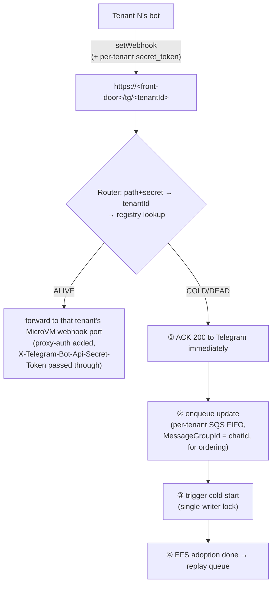
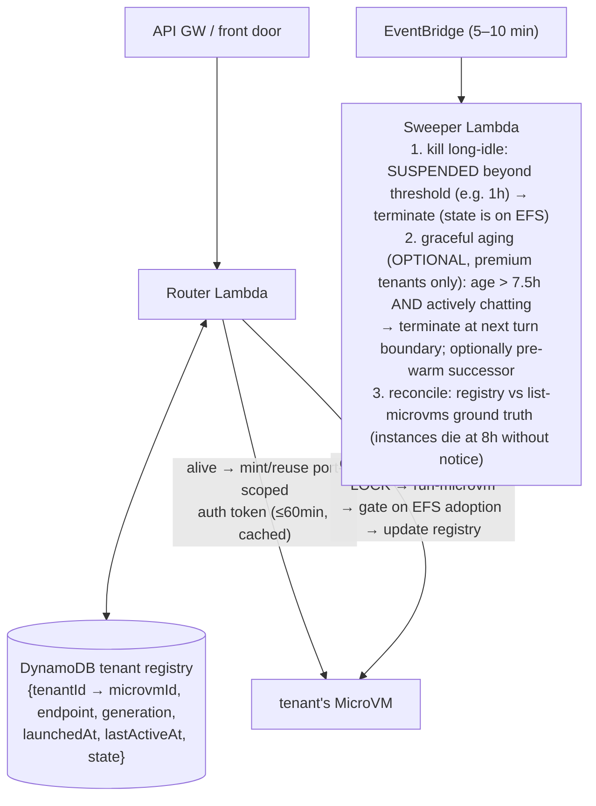

# Design — Multi-tenant Orchestrator for OpenClaw on Lambda MicroVMs

> Design doc distilled from architecture discussion, 2026-07-05. Not yet implemented.
> Foundation: all mechanisms referenced here were **live-verified** before this design —
> IMDSv2 execution-role creds, suspend/resume (~9s e2e), and EFS cross-generation state
> survival were each proven on real MicroVMs.

## Problem

One MicroVM per tenant. MicroVMs have a hard **8-hour max lifetime** (suspended time
counts too — verified), per-instance endpoints that die with the instance, and 60-min
auth tokens. Tenants expect their agent (config + memory) to be permanent. State lives
on EFS (per-tenant); compute is disposable. Someone must manage the fleet.

## Decision: Orchestrator as the primary control plane; EventBridge as sweeper only

A pure EventBridge renewal timer cannot answer the per-request questions:
1. Does this tenant have a live VM right now? (scale-from-zero is request-driven)
2. Which endpoint/token routes this request? (endpoints change every generation)
3. Does this tenant *deserve* a live VM? (idle tenants must cost ≈ 0)

Once an orchestrator answers those, resume-vs-restart is just a branch in its state
lookup. **Scale is the watershed: 1 tenant → a cron renewal is fine; N tenants → orchestrator.**

## The router has exactly TWO branches (deliberately not three or four)

```
request → lookup tenant in registry
  ├─ ALIVE (RUNNING | SUSPENDED) → forward
  │     SUSPENDED needs no decision: autoResumeEnabled=true means the platform
  │     auto-resumes on the forwarded request itself (verified: ~9s e2e).
  └─ NOT ALIVE (absent | TERMINATED | aged out) → cold-start new generation (with lock) → forward
        cold start = run-microvm (same shared image) → EFS adopt (~30–90s) → gate → forward
```

### Rejected: a third "remaining lifetime < 15min → proactive renewal" branch

Originally proposed, struck after review (user's call, confirmed correct):

1. **It overlaps branch 2.** "Dies → next request cold-starts" already covers expiry
   completely and self-consistently. Proactive renewal only converts *some* cold starts
   into warm handoffs, at the cost of a whole extra mechanism.
2. **It is actively harmful at multi-tenant scale.** Renewal makes VMs immortal —
   an idle tenant's VM never dies, its cost never reaches zero. Proactive renewal and
   the cold-tier economics (95%+ tenants idle at ≈0 cost) are logically contradictory.
3. **Overlap-style handoff (start new → healthy → kill old) violates the single-writer
   rule**: two gateways would briefly share one EFS state dir. Any renewal must be
   stop-old-then-start-new — which is semantically identical to "let it die + cold-start",
   just with a chosen timing.
4. Cost shape: **pre-warming cost scales with tenant count; lazy cold-start cost scales
   with request arrival.** Long-tail tenants must get the latter.

**Principle: the router answers only "where to forward / whether to cold-start".
"Renewal" is not a state — it is a policy, it belongs to the sweeper, and it defaults OFF.**

## Decided: push (webhook) ingress over long-polling — co-requisite of the orchestrator

IM channels (Telegram etc.) must switch from OpenClaw's default **long-polling** to
**webhook push** the moment the orchestrator exists. This is not an optimization; the
two decisions are co-dependent:

1. **Polling pins every tenant to the hot tier.** A continuous `getUpdates` loop means
   the VM is never idle → never suspends → N tenants = N full-rate RUNNING VMs. The
   cold-tier economics (idle tenant ≈ $0) collapse — the same class of self-contradiction
   as proactive renewal. Conversely, forcing suspension under polling freezes the poller
   and delays messages by minutes (120s watchdog). Under polling the orchestrator has
   no lifecycle left to manage.
2. **Push makes the three tiers actually cycle**: no messages → suspend → sweeper demotes
   to cold (≈$0); message arrives → auto-resume (~9s) or cold-start. Tenant cost finally
   tracks tenant activity.

### The two original webhook blockers dissolve under the orchestrator

| Blocker (from the initial Telegram assessment) | Resolution |
|---|---|
| Telegram cannot send `X-aws-proxy-auth` → needs a dedicated forwarding layer | **The router IS that layer** — lookup → mint token → forward is its existing job; webhook is just another entry path. Zero new components. |
| Telegram webhook timeout (seconds) vs cold start (30–90s) | Router ACKs 200 immediately, delivers async: alive → forward (suspended auto-resumes ~9s); cold → buffer in queue, replay after EFS adoption. |

### Multi-tenant push topology



Tenant identity anchors naturally: one bot token + one webhookSecret + one EFS Access
Point + one (potential) MicroVM = one registry row. OpenClaw's own
`channels.telegram.webhookUrl` config points at the tenant's front-door path and
handles `setWebhook` registration itself.

### Problems this retires, and what it adds

Retired: **409 single-poller conflicts** (webhook mode stops `getUpdates` entirely —
generation swaps lose their poller race window); **build-time message theft** (the
verified incident where a build VM consumed a live message — no poller, no incident
class; tokens still injected at run time only); **suspended-message loss** (Telegram
retries webhooks + queue buffering = zero loss, only cold-start delay).

Added/care-abouts:
1. **Per-tenant SQS FIFO** (MessageGroupId = chatId) — the only genuinely new component;
   buffers the cold-start window and preserves per-chat ordering.
2. **Cold-start UX**: 30–90s of silence looks dead in a chat — router fires
   `sendChatAction: typing` via Bot API during cold start.
3. OpenClaw's webhook listener defaults to `127.0.0.1:8787` → must bind `0.0.0.0`
   (or hop via the in-guest sidecar) for the proxy to reach it.
4. Polling is not deleted — it remains the dev/single-box demo mode.

**Principle: orchestrator and push are symbiotic — the orchestrator dissolves push's
two blockers; push makes the orchestrator's cold-tier economics real. Together they are
the complete multi-tenant shape.**

## Three-temperature tenant lifecycle (activity-driven)

| Tier | State | Cost | Restore latency | Transition |
|---|---|---|---|---|
| Hot | RUNNING | full rate | 0 | requests flowing |
| Warm | SUSPENDED | reduced rate, **8h clock still runs** (verified) | ~seconds (platform auto-resume) | idle policy, automatic |
| Cold | TERMINATED + EFS holds state | ≈0 (EFS storage only) | 30–90s cold start | sweeper kills long-idle; expiry |

Suspended is a money-saving waypoint, not a parking lot — the 8h cap guarantees every
generation dies. The cold tier is the economic foundation of multi-tenancy.

## Components



Shared: **ONE MicroVM image for all tenants** (tenant differences live entirely on EFS)

## Multi-tenant invariants (hard rules)

1. **One EFS Access Point per tenant** (`/tenants/<id>`, POSIX identity) on one shared
   EFS — isolation + fixes the root-squash hygiene issue found in the EFS PoC.
   The per-tenant AP path is injected at run time (runHookPayload or env via registry).
2. **Single-writer lock per tenant.** DynamoDB conditional write around cold-start:
   never two live generations of one tenant (two gateways on one EFS dir + double
   IM pollers = the verified 409/corruption failure modes). Same rule that emerged
   from the Telegram single-poller incident.
3. **Gate cold-start traffic on EFS adoption.** The efs-monitor bounces the gateway
   after bind-mount; forward only after the adoption marker is visible. The router's
   own first GET conveniently doubles as the runtime-marker unlock for the mount daemon.
4. **8h death loses in-flight turns** — only EFS-flushed state survives. Acceptable for
   default (lazy) policy; premium tenants get sweeper policy 2.

## Known numbers (from live PoCs)

- Suspended→RUNNING via forwarded request: **~9s** e2e including a full Bedrock turn.
- Cold start (run-microvm → EFS adopt → gateway bounce): **~30–90s**.
- Image build: 4–6 min/version. Auth token TTL: ≤60 min (cache + refresh in router).
- First turns through a bedrock-runtime VPC endpoint were slow (60–77s) — warm paths faster.

## Open questions for implementation

- Token caching strategy in the router (per-tenant token vs per-request mint).
- WebSocket sessions across generation swap (Control UI reconnect story).
- Sweeper's "turn boundary" detection for graceful aging (gateway API? log tail?).
- Registry schema for image-version rollout (generation swap doubles as rolling upgrade).
- Webhook replay semantics: dedupe on Telegram update_id when replaying the FIFO after
  cold start (Telegram may also retry on its own — at-least-once, needs idempotency).
- Does OpenClaw's webhook mode tolerate a bounced gateway mid-delivery (EFS adoption
  restart) without dropping the in-flight update? Verify empirically.
